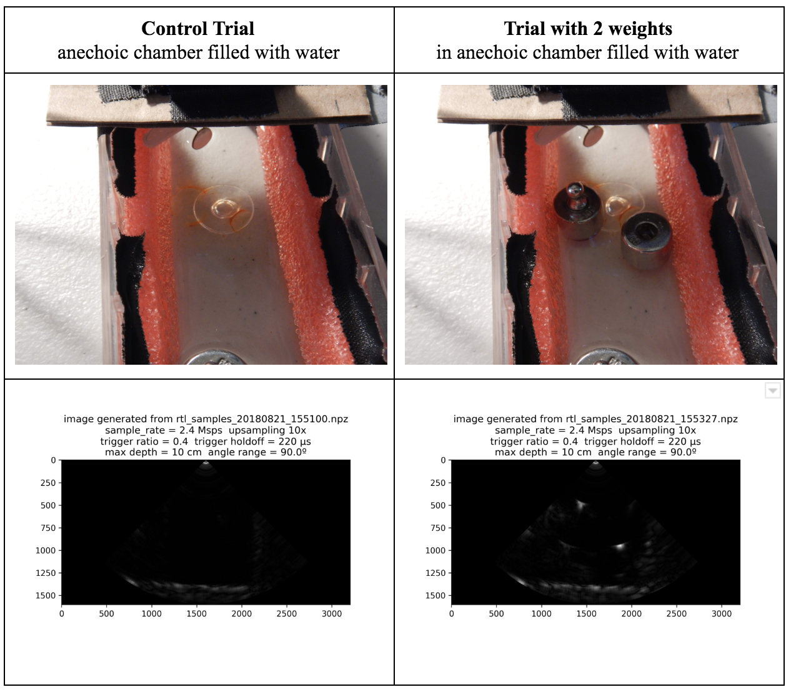

# rtl-ultrasound

**Software**
&larr;
[Firmware](https://github.com/wlmeng11/SimpleRick_firmware)
&larr;
[Hardware](https://github.com/wlmeng11/SimpleRick)

TODO: logo next to title

TODO: get badges

* build passing (Travis)
* build passing (appveyor)
* coverage x% (coveralls.io)
* docs passing (readthedocs.io)
* code quality (codacy)
* DOI (zenodo)

## Latest results

See the [Aug 21, 2018 writeup](experiments/20180821/README.md) for more details.

_Piezoelectric transducer is swept by servo motor_

_Hardware setup with [SimpleRick v1.1](https://github.com/wlmeng11/SimpleRick/), 12.5 MHz low pass filter, and RTL-SDR_

## Introduction

### Why SDR?
The analog signal produced by a B-mode ultrasound (ie. 2D imaging)
is essentially an Amplitude Modulated (AM) signal. The signal's envelope (ie. amplitude) corresponds to boundary information in the physical media, and the signal's carrier frequency is equal to the resonant frequency of the transducer.

Most ultrasound systems take one of two approaches for data acquistion:

1. **Direct sampling of the ultrasound signal:**
This method preserves the original signal in the time domain, accomodates any transducer frequency, and offers the best flexibility for post-processing and analysis. Both amplitude and phase information can be extracted the signal, so it is useful for both B-mode and Doppler mode imaging.
However, this method requires a high sample rate ADC, as well as high bandwidth and storage for the digital data. 
2. **Envelope detection with analog hardware:** Perform Amplitude Demodulation (typically with a diode-based rectifier and low pass filter) to yield an envelope signal, then acquire the envelope signal at a lower sample rate.
This method reduces the bandwidth and storage requirements for the digital data, but there are a number of drawbacks: 
	* Unless the low pass filter is adjustable, this method cannot accommodate different transducer frequencies.
	* The non-linearity of the diode may produce harmonic distortion.
	* All phase information in the signal is lost, rendering it useless for Doppler mode imaging.

It has been [demonstrated by Peyton et al](https://biomedical-engineering-online.biomedcentral.com/articles/10.1186/s12938-018-0512-6) that quadrature sampling can be used to reduce bandwidth requirements in an ultrasound imaging system.

It turns out that quadrature modulation is essential to Software Defined Radio (SDR) because any type of amplitude modulation, frequency modulation, phase modulation, or combination of these can be expressed as a special case of quadrature modulation. Therefore, many of the software and hardware techniques used in SDR can be applied to ultrasound imaging.

### Why RTL-SDR?
The RTL2832U chip in the RTL-SDR takes a hybrid approach for data acquisition. It employs a high sample rate ADC (28.8 Msps), followed by a software-configurable Digital Down Converter (DDC) that produces IQ data at a lower sample rate (up to 2.56 Msps), thus reducing bandwidth and storage requirements. We can then perform envelope detection *in software*.

Plus, the RTL-SDR is really cheap (under $25 on Amazon in the United States)!
As such, there is a lot of software support and a large community for the RTL-SDR.

With a few software tweaks, it should be possible to substitute the RTL-SDR with a more expensive SDR (eg. AirSpy HF+, LimeSDR) for use cases that require better ADC resolution and SNR.

TODO: total system cost

## Installation
### System Dependencies
Install the system dependencies:

* Python 3 with pip
* librtlsdr

#### Mac OSX
`brew install python3 librtlsdr`

*Warning*: If you previously installed software that bundles an out-of-date version of librtlsdr,
you may have to remove it, or overwrite the symlinks for librtlsdr: `brew link --overwrite librtlsdr`

### Automatic installation
Install rtl-ultrasound:  
`pip3 install rtl-ultrasound`

### Manual installation
Clone the development repo:  
`git clone git@github.com:wlmeng11/rtl-ultrasound.git`

Install the python package dependencies:  
`pip3 install -r requirements.txt`

Run the install script:  
`pip3 install .`

## Usage
### Hardware Setup
This software is designed to be used with the [RTL-SDR v3](https://www.rtl-sdr.com/buy-rtl-sdr-dvb-t-dongles/)
in conjunction with the [SimpleRick](https://github.com/wlmeng11/SimpleRick) hardware.

TODO: block diagram

However, this software can be also used with any ultrasound hardware which
provides an analog signal output that can be fed to the input of the RTL-SDR.

### Capturing images
To capture approximately 1 second of data from the RTL-SDR and save it to a .npz file, run:  
`rtl_to_npz -v -n 5120000`

Next, generate an image from the .npz file:  
`B_mode -v --data (data file name).npz`

In the future, this process will be streamlined into a single script and possibly a GUI.

## Documentation
A fairly comprehensive overview of the entire process from data acquisition to rendered image
can be found in the [Aug 13, 2018 experiment](experiments/20180813/rtlsdr_ultrasound_test.ipynb).

Essentially, it boils down to these steps:

* acquire IQ samples from RTL-SDR
* upsample
* extract envelope
* split signal into scan lines
* stack scan lines into image
* perform polar to cartesian image transformation

TODO: these steps will be parallelized with multithreading in order to
provide a fast image update rate with pipelining

## DISCLAIMER
This software is NOT meant to be used for any medical or diagnostic purposes.

Absolutely no warranty is provided, express or implied.

## License
The software contained in this repository makes use of the pyrtlsdr module, and is therefore a derivative work of pyrtlsdr. As such, this work respects the GPL v3 license of pyrtlsdr and is similarly distributed under GPL v3.

The full text of the license can be found in the [COPYING](COPYING) file.

[pyrtlsdr](https://github.com/roger-/pyrtlsdr) is Copyright (C) 2013 by Roger https://github.com/roger-

[rtl-ultrasound](https://github.com/wlmeng11/rtl-ultrasound/) is Copyright (C) 2018 William Meng
